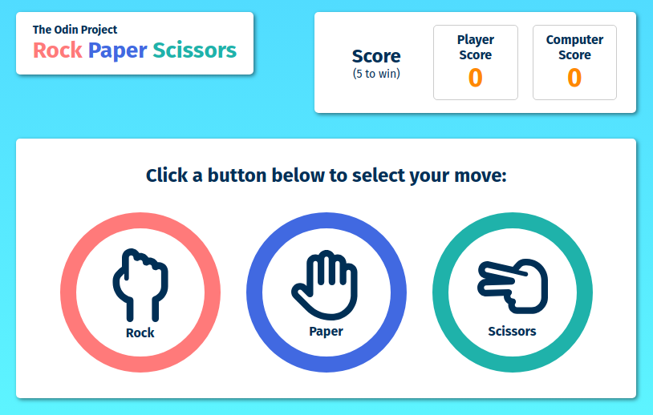

# Rock Paper Scissors

## Overview
This Rock Paper Scissors project was created as part of The Odin Project's curriculum to test what was learned of JavaScript so far.

## Screenshot

## Features
The game started off as console-based, but a GUI has now been added. The game now features three buttons for the player to choose from: "Rock", "Paper", or "Scissors", with the score also displayed on screen. The game is played by choosing an option and comparing that option against a computer-generated response. The game will continue until either the player or the computer reaches a score of five. After the game is complete, the user is able to start a new game, if desired.

## What I Learned
Since I haven't used JavaScript in a while, this project was great practice. It helped put together all that I've learned so far in The Odin Project along with what I've previously learned on my own. 

I utilized the previous lessons in The Odin Project curriculum on problem solving and debugging, which helped me break down larger problems into smaller problems and debug any errors that occurred. Writing the program out in pseudocode first was also indispensible. Being able to see how everything would work together before writing any actual code made development much more efficient.

I also did some research into various ways to implement CSS, such as BEM and utility-first. Ultimately, I decided to go with a utility-first approach and used BEM as needed for components that needed more specific styling. I was concerned about the readability of the HTML file with this approach, but it worked well for this project. The CSS file appears more organized and being able to re-use the utility classes made it easier to apply styles where needed without creating more classes.

## What I Used
* Git
* GitHub
* HTML / CSS
* JavaScript
* VSCode

## Live Demo
[View Live Demo](https://creative-cookie.github.io/odin-rock-paper-scissors)